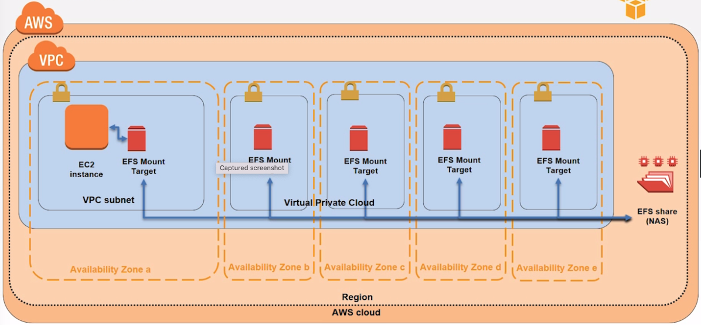

## Elastic File System

- S3 is object storage
- EBS is attached to instances
- EFS can be mounted by multiple EC2 instances
  - require NFS client
  - each AZ/subnet must have a different mount target to which EC2 can connect to
  - different mount target can point to the same EFS, so that EC2 across different AZs can access EFS



### Lab

1. create a EFS
2. create an EC2 instance
3. add the EC2's security group to each of the mount target of EFS
4. edit the EC2's security group inbound rule to allow `NFS` from itself
5. SSH into EC2

```
[ec2-user@ip-172-31-86-82 ~]$ sudo mkdir efs
[ec2-user@ip-172-31-86-82 ~]$ sudo mount -t nfs4 -o nfsvers=4.1,rsize=1048576,wsize=1048576,hard,timeo=600,retrans=2 fs-0e3b42ea16c2ace32.efs.us-east-1.amazonaws.com:/ efs
[ec2-user@ip-172-31-86-82 ~]$ cd efs/
[ec2-user@ip-172-31-86-82 efs]$ sudo touch _SUCCESS
[ec2-user@ip-172-31-86-82 efs]$ ls
_SUCCESS
```
